RL Problems based on Bellman equation & Dynamic programming
===========================================================

[Bellman equation](https://en.wikipedia.org/wiki/Bellman_equation) 
is a very popular equation used to solve MDP (Markov Decision Process)
based RL problems.

Jump to:  
*  [Jack's Car Rental](#jacksCarRental)
*  [Gambler's Problem](#gamblersProblem)

---

## Jack's Car Rental
Implementation of Example 4.2: Jack’s Car Rental from the [book](#rlbook).

### Source: 
* [__jackCarRental.py__](./jackCarRental.py)  

* [__jackCarRentalCpp.py__](./jackCarRentalCpp.py)  
  Solution using cppLib for better performance.  

### Plots
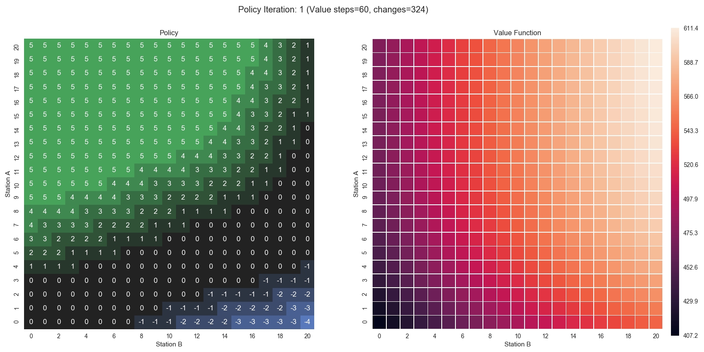
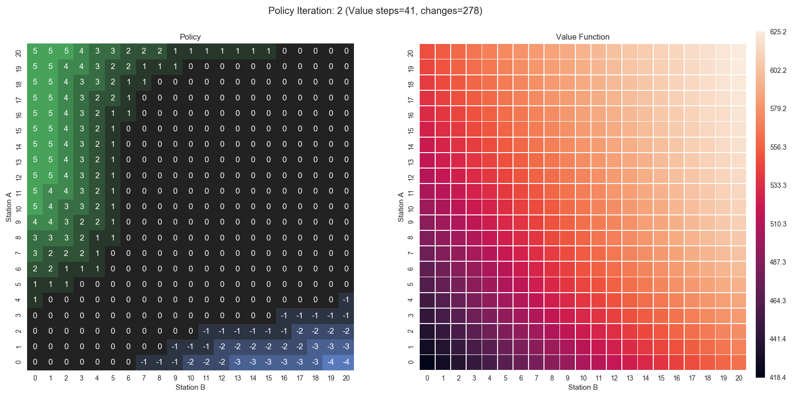
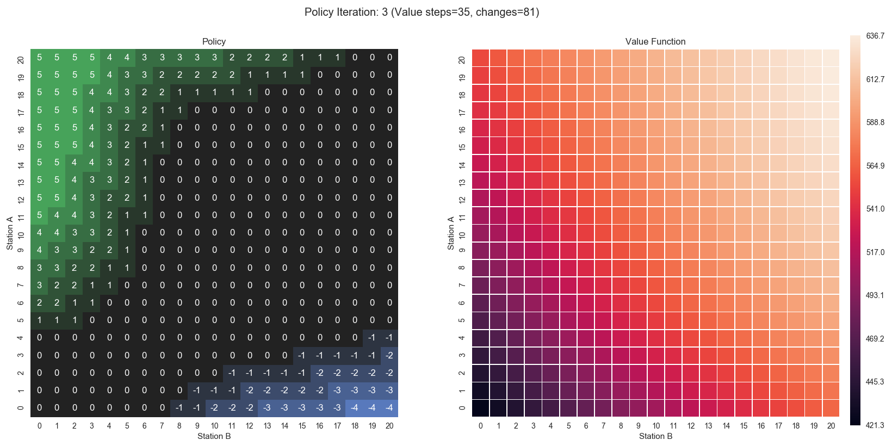
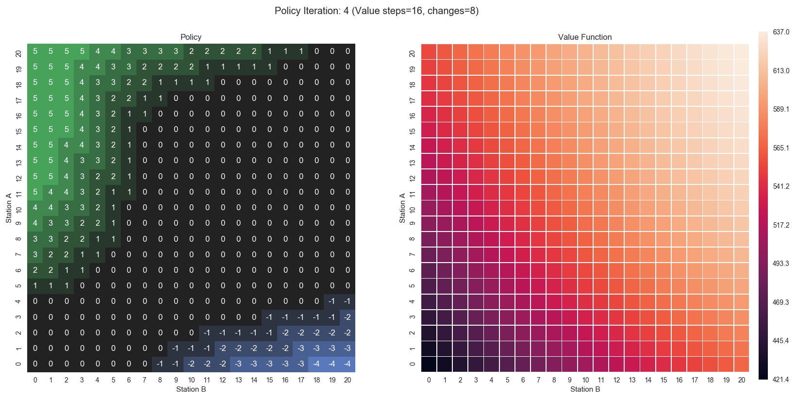

It happens to be that there was a bug in charts of the 2nd edition of 
the [book](#rlbook). The old code did not have any dependence on car 
rental returns whicle calculating reward (thanks to [John Weatherwax](#johnsweb)
code).

New Plots:
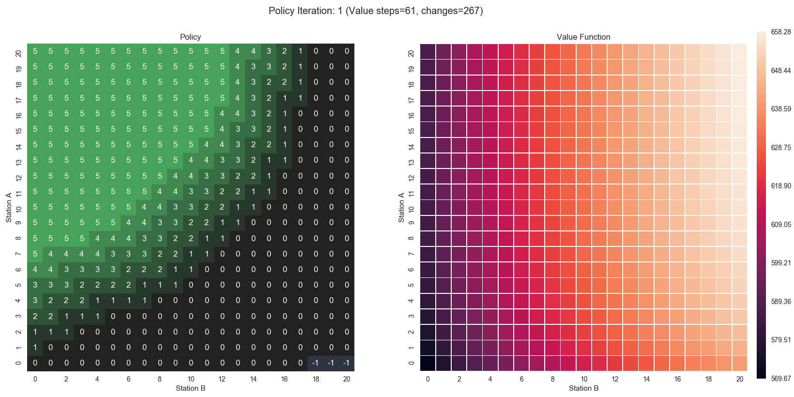
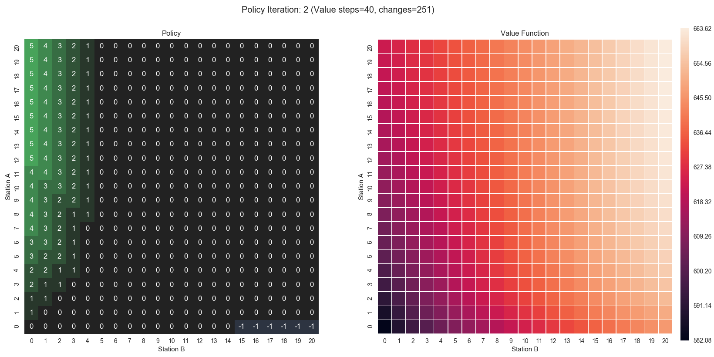
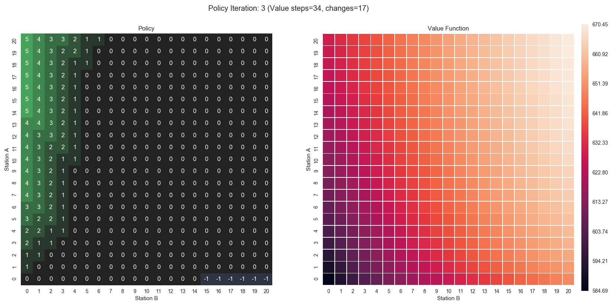

---

## Gambler's Problem
Implementation of Example 4.3: Gambler’s Problem from the [book](#rlbook).

### Source: 
* [__gamblersProblem.py__](./gamblersProblem.py)  

### Plots
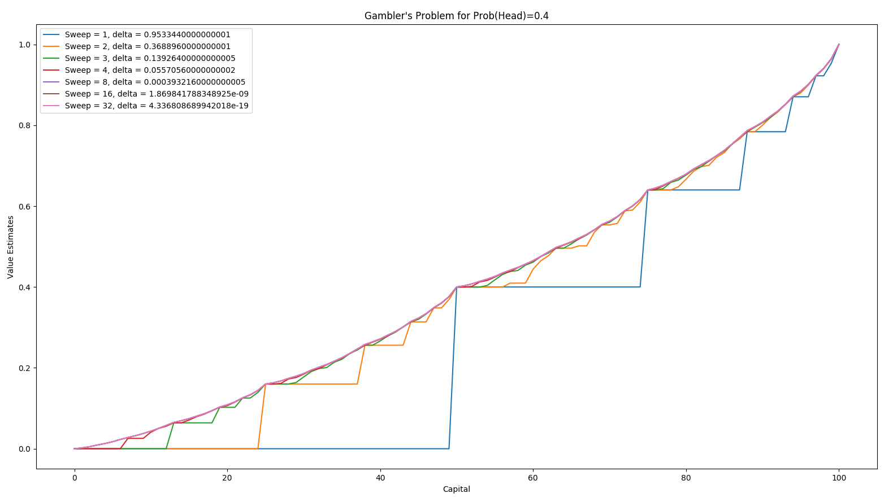
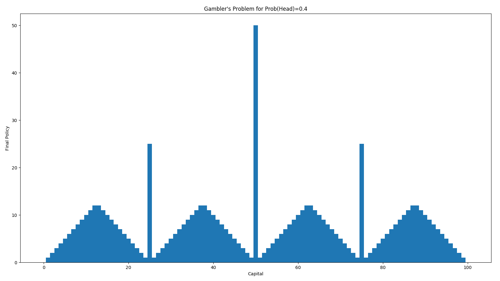
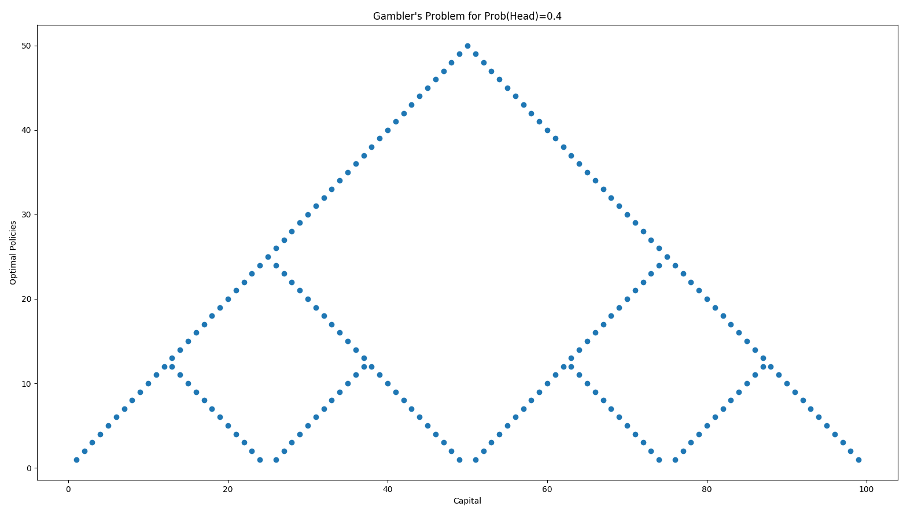

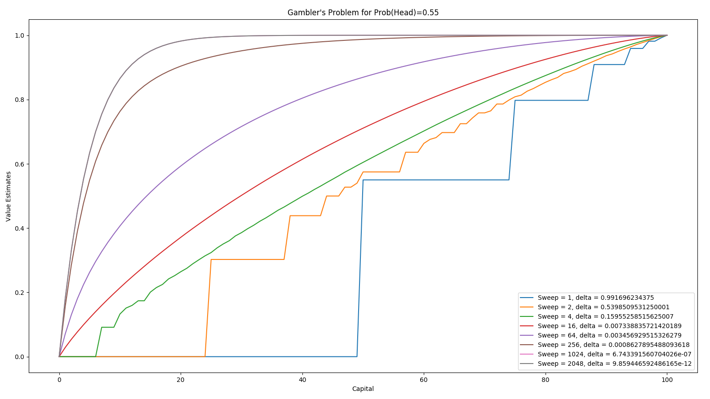
Not that in case of Probability(head) > 0.5 the best strategy will 
always be to bet 1$.

---

References:  
1	
	[Reinforcement Learning: An Introduction by Sutton & Barto](https://mitpress.mit.edu/books/reinforcement-learning)  
2	
	[John Weatherwax's Code](http://waxworksmath.com/Authors/N_Z/Sutton/WWW/chapter_4.html)