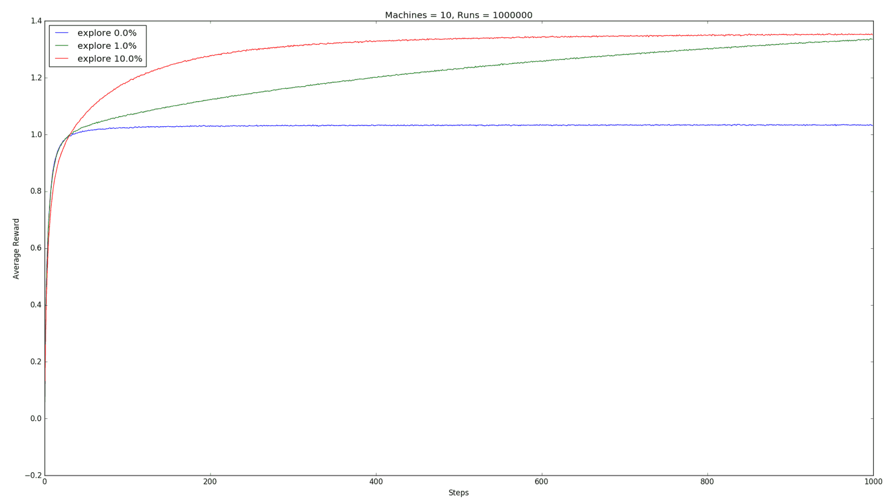

n-Armed Bandit
===============

A solution to classic __n-armed bandit__ problem.

__Problem__: You have _n-armed bandit_ (slot-machine), when you pull any _arm_ 
it'll give you reward based on the distribution of that _arm_. For simplicity 
we assume that every bandit's reward is a gaussian distribution of some mean.
And that mean is also coming form a gaussian distribution, so that different
bandits will have different means. You have given a fixed number of chances 
(in experiment 1000) to pull the _arm_. Now, you want to maximize your overall 
reward.

Jump to:  
*  [Solutions](#solutions)
*  [Plots](#plots)

---

## Solutions

* [__eGreedy.py__](./eGreedy.py)  
  e-greedy solution to n-armed bandit. The agent will explore the environment
  with probability _e_ and exploit with _1-e_.  
  [plots](#eGreedyPlots)

* [__eDecrease.py__](./eDecrease.py)  
  The exploration probability will decay exponentially over time. So that the
  agent will exploit more as time passes.  
  [plots](#eDecreasePlots)

* [__eGreedySoftMax.py__](./eGreedySoftMax.py)  
  softmax solution to n-armed bandit. The agent will explore the environment
  with probability _e_ and exploit with _1-e_.  
  [plots](#eGreedySoftMaxPlots)

* [__eGreedySoftMaxOptimistic.py__](./eGreedySoftMaxOptimistic.py)  
  An optimistic start for e-greedy or softmax. It assumes the average reward of 
  bandits to 5 instead of 0.  
  [plots](#eGreedySoftMaxOptimistic)

* [__eGreedySoftmaxCpp.py__](./eGreedySoftmaxCpp.py)  
  _eGreedySoftMax_ solution by using cppLib for better performance.  
  [plots](#eGreedySoftMaxPlots)

---

## Plots

### greedy vs e-greedy

### e-greedy vs e-decrease

### greedy vs e-greedy vs softmax

### zero-start vs optimistic

